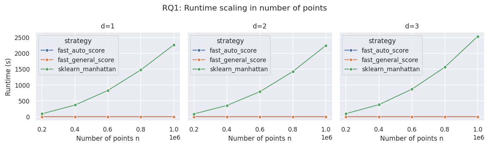

# Manhattan Silhouette

Fast exact silhouette evaluation under
[Manhattan distance](https://en.wikipedia.org/wiki/Taxicab_geometry).



_Figure 1: Runtime comparison between a generic pairwise-distance baseline and
Manhattan-specific implementations on synthetic benchmark instances._

## Overview

Evaluating clustering quality is a common task in cluster analysis. The
[silhouette coefficient](<https://en.wikipedia.org/wiki/Silhouette_(clustering)>)
compares, for each data point, the average distance to points in its own cluster
with the average distance to points in the nearest other cluster. The mean over
all samples is often called the Average Silhouette Width (ASW).

Generic silhouette implementations usually work from pairwise distances. This is
simple and metric-independent, but it becomes expensive for large datasets
because the full distance matrix has quadratic size.

`manhattan-silhouette` computes exact silhouette values for fixed cluster labels
under Manhattan (L1) distance without materializing the full `n × n` distance
matrix. It uses the additive structure of the Manhattan distance and
Numba-compiled kernels to make repeated scoring and large synthetic benchmarks
practical.

The package answers the question:

> Given data points and cluster labels, what are the exact silhouette values
> under Manhattan distance?

It does **not** compute cluster labels itself.

## Installation

```bash
pip install manhattan-silhouette
```

For development from source:

```bash
git clone git@github.com:anomatomato/manhattan-silhouette.git
cd manhattan-silhouette
uv sync --all-extras --all-groups
```

## Examples

The public API mirrors the two common silhouette use cases:

- `silhouette_samples_manhattan(...)` returns one silhouette value per sample.
- `silhouette_score_manhattan(...)` returns the mean silhouette score.

## Quickstart

```python
import numpy as np

from manhattan_silhouette import (
    silhouette_samples_manhattan,
    silhouette_score_manhattan,
)

X = np.array(
    [
        [0.0, 0.0],
        [0.2, 0.1],
        [3.0, 3.1],
        [3.3, 3.0],
    ],
    dtype=np.float64,
)
labels = np.array([0, 0, 1, 1], dtype=np.intp)

samples = silhouette_samples_manhattan(X, labels)
score = silhouette_score_manhattan(X, labels)

print(samples)
print(score)
```

## API

```python
silhouette_samples_manhattan(
    X,
    labels,
    check_1d_disjoint=False,
    compute_by_cluster=True,
)
```

Returns an array of shape `(n_samples,)` with one silhouette value per sample.

```python
silhouette_score_manhattan(
    X,
    labels,
    check_1d_disjoint=False,
    compute_by_cluster=True,
)
```

Returns the mean silhouette value as a `float`.

Parameters:

- `X`: array-like of shape `(n_samples, n_features)`
- `labels`: array-like of shape `(n_samples,)`
- `check_1d_disjoint`: if `True`, use a specialized kernel for one-dimensional
  data when cluster intervals are disjoint
- `compute_by_cluster`: choose the cluster-oriented implementation (`True`,
  default) or the axis-oriented implementation (`False`)

## Experimental Results

We benchmarked the implementation on synthetic Gaussian-blob and uniform
instances. The benchmark compares:

- `fast_by_cluster_score`: the default cluster-oriented implementation
- `fast_by_axis_score`: an axis-oriented implementation
- `sklearn_manhattan`: a generic scikit-learn-style Manhattan silhouette
  baseline

On million-point instances with five clusters, the cluster-oriented
implementation was several thousand times faster than the generic baseline:

| Dimensions | Standard baseline (s) | `fast_by_cluster_score` (s) | Speedup |
| ---------: | --------------------: | --------------------------: | ------: |
|          1 |                2322.3 |                       0.161 | 14,467× |
|          2 |                2281.6 |                       0.274 |  8,318× |
|          3 |                2572.1 |                       0.406 |  6,341× |

More plots and the scripts that generated them are available in
[`evaluation/runtime_manhattan_silhouette/`](evaluation/runtime_manhattan_silhouette/).

## Development

Install development dependencies:

```bash
uv sync --all-extras --all-groups
```

Run tests:

```bash
uv run pytest
```

Build the source distribution and wheel:

```bash
uv build
```

Check package metadata before uploading:

```bash
uvx twine check dist/*
```

## Contribution

Contributions are welcome. Useful contributions include:

- bug reports with small reproducible examples
- comparisons against trusted silhouette implementations
- documentation improvements
- performance investigations on additional datasets

Before opening a pull request, please run the test suite with `uv run pytest`.

## References

[1] Peter J. Rousseeuw. **Silhouettes: A graphical aid to the interpretation and
validation of cluster analysis**. _Journal of Computational and Applied
Mathematics_, 20:53--65, 1987.

[2] An Hoang. **Exact Silhouette Score Maximization and Fast Manhattan
Silhouette Evaluation**. Bachelor thesis, TU Braunschweig, 2026.
