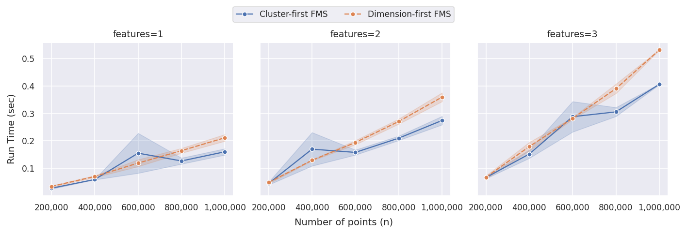
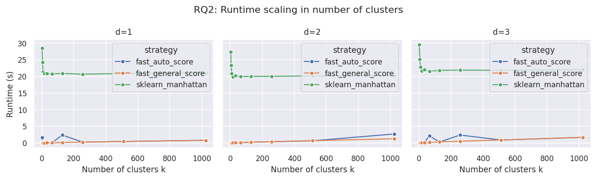
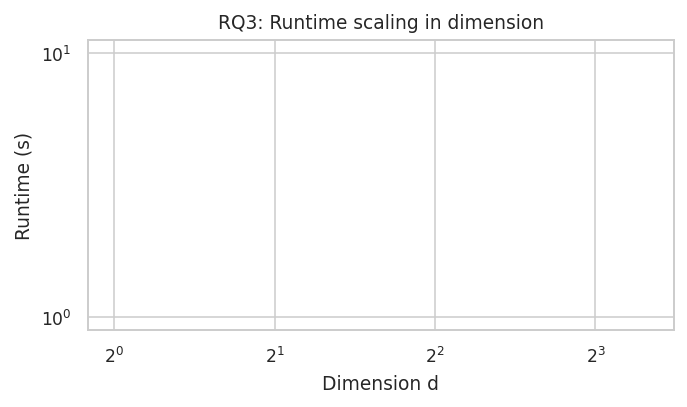

# Runtime Benchmark for Manhattan Silhouette

Benchmark scripts and public result artifacts for `manhattan-silhouette`.



_Figure 1: Runtime scaling with the number of samples._

## Overview

This benchmark evaluates how quickly exact Manhattan silhouette scores can be
computed when the cluster labels are already known. It compares two
Manhattan-specific implementations against a generic pairwise-distance baseline.

The benchmark was designed for the accompanying thesis, but the public figures
and scripts are kept here so package users can inspect the performance claims
behind the README.

## Compared Implementations

The benchmark compares three scoring functions:

- `fast_by_cluster_score`: calls `silhouette_score_manhattan` with the default
  cluster-oriented computation order
- `fast_by_axis_score`: calls `silhouette_score_manhattan` with the
  axis-oriented computation order
- `sklearn_manhattan`: generic baseline using scikit-learn's Manhattan
  silhouette functionality

All methods compute the same silhouette quantity under Manhattan distance. The
difference is runtime, not the objective definition.

## Experimental Setup

Synthetic instances are generated with one fixed root seed. Each setting uses
both Gaussian-blob and uniform data variants.

The benchmark varies three parameters:

| Question | Fixed values                   | Varied parameter       |
| -------- | ------------------------------ | ---------------------- |
| RQ1      | `k = 5`, `d ∈ {1, 2, 3}`       | number of samples `n`  |
| RQ2      | `n = 100,000`, `d ∈ {1, 2, 3}` | number of clusters `k` |
| RQ3      | `n = 100,000`, `k = 5`         | dimension `d`          |

The exact ranges are defined in [`_conf.py`](_conf.py).

## Running the Benchmark

Install the development environment from the repository root:

```bash
uv sync --all-extras --all-groups
```

Run the full pipeline from this directory:

```bash
uv run python run_all.py
```

Useful options:

```bash
uv run python run_all.py --max-instances 10
uv run python run_all.py --seed 12345
uv run python run_all.py --skip-generate --seed 12345
uv run python run_all.py --skip-benchmark --analyze
```

The full benchmark can be expensive. For a quick smoke run, use
`--max-instances`.

## Results

### Scaling in the Number of Samples


The Manhattan-specific implementation stays below one second on the largest
million-point settings shown here, while the generic baseline takes thousands of
seconds.

### Scaling in the Number of Clusters



The Manhattan-specific methods remain fast when the number of clusters grows.
This matters for validation workflows that score many candidate clusterings.

### Scaling in the Dimension



Runtime grows with dimension, as expected for an L1 method that processes each
coordinate. The implementation avoids the quadratic memory bottleneck of a full
pairwise-distance matrix.

## Data Layout

- `PUBLIC_DATA/instance_db/`: generated benchmark instances as `.npz` files
- `PUBLIC_DATA/simplified_results.json.zip`: compact extracted results
- `PUBLIC_DATA/figures/`: exported `.png` and `.pdf` plots
- `PUBLIC_DATA/tables/`: exported table artifacts
- `PRIVATE_DATA/full_experiment_data/`: raw benchmark output for debugging and
  re-analysis

For reading the benchmark, start with `PUBLIC_DATA/figures/` and
`PUBLIC_DATA/tables/`. The private data is not needed for a quick inspection.

## Reproducibility Notes

- Reruns may differ slightly because runtime measurements depend on hardware,
  operating system load, and Numba compilation state.
- The first call to a Numba-compiled function may include compilation overhead.
- Large settings are intended as full benchmark runs, not quick unit tests.
- The public result files document the benchmark state used for the thesis and
  package README.

## References

[1] Peter J. Rousseeuw. **Silhouettes: A graphical aid to the interpretation and
validation of cluster analysis**. _Journal of Computational and Applied
Mathematics_, 20:53--65, 1987.
